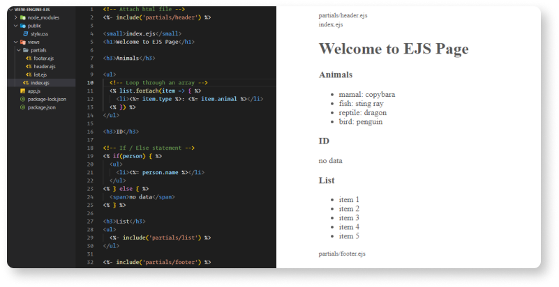

# EJS view engine
EJS stands for Embeded JavaScript. It's a templating script to generate dynamic web pages using JavaScript. Errors are easier to debug: error output includes line-numbers.

### Main tags
| tags | description |
| ------ | ------ |
| **<% %>** | Javascript logic (Control flow) |
| **<%= %>** | Escaped output to page |
| **<%- %>** | Unescaped output to page (Raw Html) |
| **<%# %>** | Comment tag, no execution, no output |

### Embed other HTML files
```sh
  <%- include('partials/header') %>
```

### Iterate through an array
```sh
  <% list.forEach(item => { %>
    <li><%= item.name %></li>
  <% }) %> 
```

